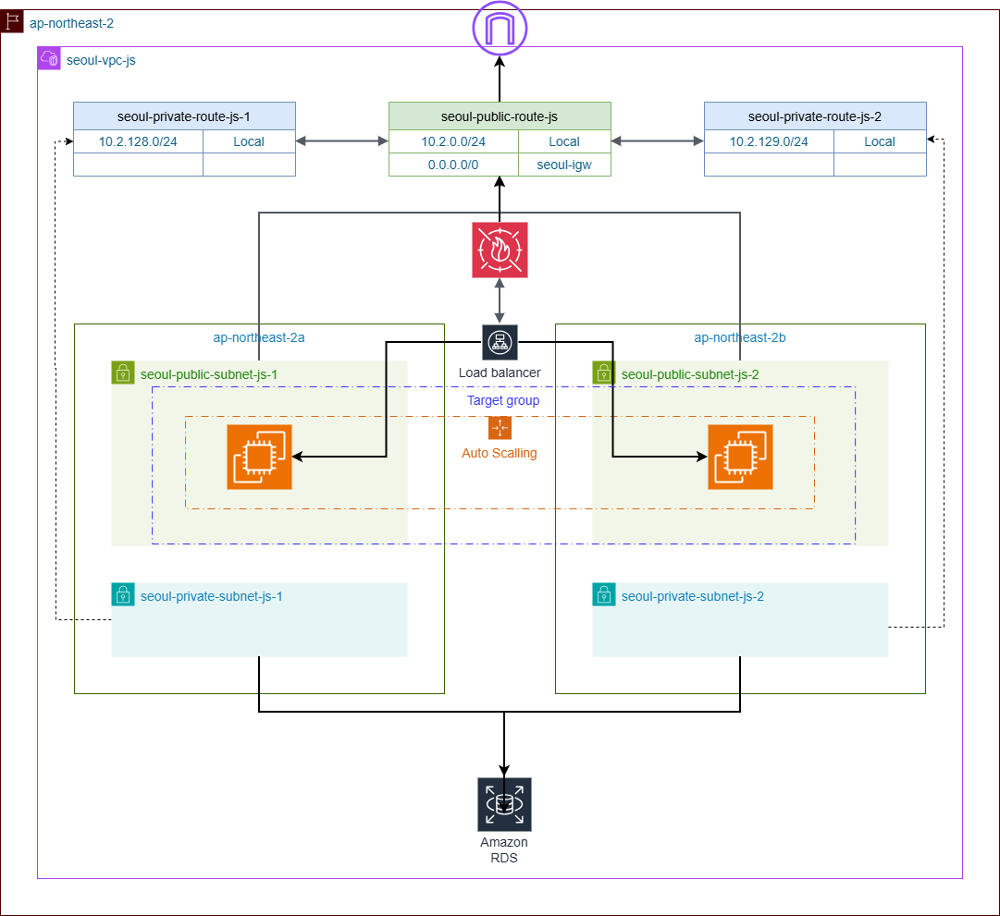

# AWS Infrastructure as Code (Terraform)

WordPress 웹 애플리케이션을 위한 AWS 인프라 자동화 프로젝트입니다.

## 📁 프로젝트 구조

```
Project_aws_name/
├── modules/                    # 재사용 가능한 Terraform 모듈
│   ├── vpc/                   # VPC 네트워크 인프라
│   ├── security-group/        # 보안 그룹 (방화벽 규칙)
│   ├── keypair/               # SSH 키 페어 생성
│   ├── rds/                   # RDS 데이터베이스 (MariaDB)
│   ├── launch_template/       # EC2 시작 템플릿
│   ├── target-group/          # 로드밸런서 대상 그룹
│   ├── load-balancer/         # Application Load Balancer
│   ├── auto-scaling/          # Auto Scaling Group
│   ├── waf/                   # Web Application Firewall
│   └── route53/               # DNS 레코드 관리
│
├── seoul/                  # [폴더] 서울 리전의 실제 인프라를 배포하는 실행 환경
│   ├── main.tf             # 서울 리전 인프라 메인 구성 및 모듈 호출 코드
│   ├── variables.tf        # 외부 입력(환경변수 등)을 받기 위한 변수 정의 파일
│   ├── variables.yml       # 네트워크 대역, 보안 규칙 등을 한곳에서 관리하는 중앙 설정 파일
│   ├── load-env.sh         # (Linux/Mac) .env 파일의 보안 정보를 환경변수로 로드하는 스크립트
│   └── load-env.ps1        # (Windows) .env 파일의 보안 정보를 환경변수로 로드하는 스크립트
├── .gitignore              # 보안 민감 파일(tfstate, .env)의 Git 업로드 방지 설정
├── README.md               # 프로젝트 전체 개요, 아키텍처 및 기술 스택 요약 문서
├── BACKEND_SETUP.md        # 협업을 위한 S3 및 DynamoDB 기반 Remote State 구축 가이드
├── ENV_SETUP.md            # 보안 강화를 위한 환경변수 기반 민감 정보(비밀번호) 설정 가이드
└── README_EC2.md           # 운영 편의를 위한 EC2 인스턴스 개수 동적 조절 및 관리 가이드
```
## 아키텍쳐 설계도 


## 🚀 주요 기능

### 1. 네트워크 인프라 (VPC)
- VPC, 서브넷, 라우팅 테이블, 인터넷 게이트웨이 구성
- 퍼블릭/프라이빗 서브넷 분리

### 2. 보안
- Security Group: 웹 서버, 데이터베이스, 로드밸런서별 방화벽 규칙
- WAF: SQL Injection, WordPress 공격, 일반 웹 공격 차단
- SSH 키 페어: EC2 인스턴스 접속용

### 3. 컴퓨팅
- Auto Scaling Group: 트래픽에 따라 자동 확장/축소
- Launch Template: EC2 인스턴스 시작 템플릿
- Application Load Balancer: 트래픽 분산

### 4. 데이터베이스
- RDS MariaDB: WordPress 데이터베이스
- 프라이빗 서브넷에 배치하여 보안 강화

### 5. 모니터링 및 로깅
- WAF Logging: CloudWatch Logs에 모든 요청 저장
- CloudWatch Alarms: 공격 탐지 시 알림

### 6. DNS
- Route53: 사용자 정의 도메인 연결

## 📝 사용 방법

### 1. 사전 준비
```bash
# Terraform 설치 확인
terraform version

# AWS 자격 증명 설정
aws configure
```

### 2. 설정 파일 수정
```bash
cd seoul

# variables.yml 파일 수정
# - 리전, VPC CIDR, 인스턴스 타입 등 설정
```

### 3. 인프라 배포
```bash
# Terraform 초기화
terraform init

# 실행 계획 확인
terraform plan

# 인프라 생성
terraform apply
```

### 4. EC2 인스턴스 개수 동적 설정 (선택사항)
```bash
# terraform.tfvars 파일 생성
cp terraform.tfvars.example terraform.tfvars

# 인스턴스 개수 설정
# terraform.tfvars:
# ec2_instance_counts = {
#   web = 2
#   db  = 1
# }

terraform apply
```

## 🔒 보안 주의사항

다음 파일들은 `.gitignore`에 포함되어 Git에 커밋되지 않습니다:
- `*.tfstate` - Terraform 상태 파일 (민감 정보 포함)
- `id_rsa*` - SSH 키 파일
- `wp-config.php` - WordPress 설정 (DB 비밀번호 포함)
- `*.tfvars` - 변수 파일 (민감 정보 포함 가능)

## 📚 모듈별 설명

각 모듈의 상세 설명은 해당 디렉토리의 `main.tf` 파일을 참조하세요.

## 🛠️ 문제 해결

### WAF 로그 확인
- AWS 콘솔 → CloudWatch → Logs → `/aws/waf/seoul-waf-js`

### WAF 공격 차단 확인
- AWS 콘솔 → WAF & Shield → Web ACLs → `seoul-waf-js` → Sampled requests


## 🔒 보안 주의사항

다음 파일들은 민감한 정보를 포함할 수 있으므로 주의하세요:
- `*.tfstate` - Terraform 상태 파일 (AWS 리소스 정보 포함)
- `id_rsa*`, `*.ppk` - SSH 키 파일
- `*.tfvars` - 변수 파일 (비밀번호 등 포함 가능)


